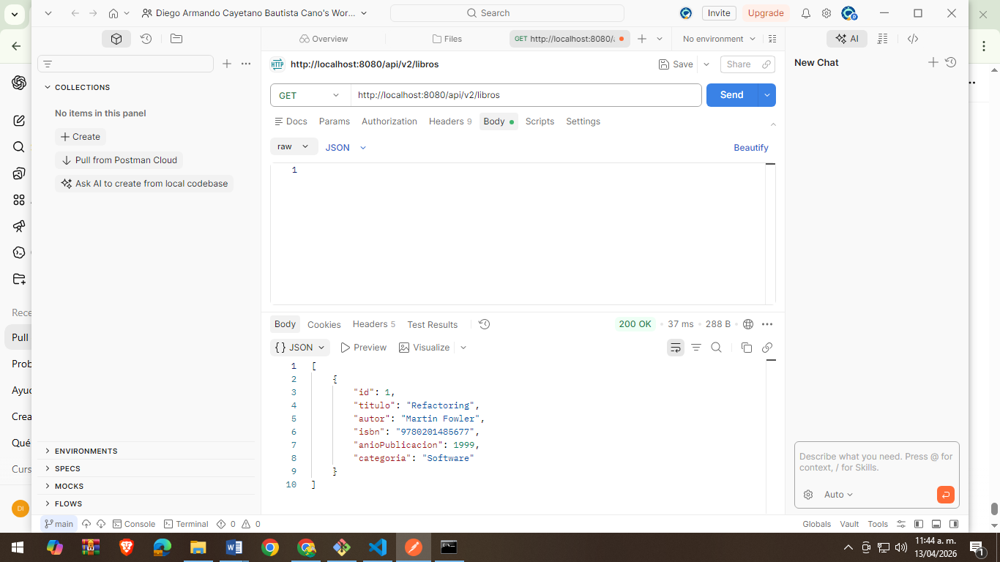

API REST - Gestión de Libros (Spring Boot)
📌 Descripción del Proyecto

Este proyecto consiste en el desarrollo de una API REST utilizando Spring Boot, aplicando buenas prácticas de arquitectura en capas y patrones de diseño.

La API permite gestionar un catálogo de libros, implementando operaciones CRUD (Crear, Leer, Eliminar), utilizando DTOs para separar el modelo de dominio del contrato de la API, manejo global de errores y validación de datos.

🏗️ Arquitectura del Proyecto

El proyecto sigue una arquitectura en capas:

Controller → Maneja las solicitudes HTTP
Service → Contiene la lógica de negocio
Repository → Acceso a base de datos (JPA)
Model (Entity) → Representación de la base de datos
DTO → Objetos de transferencia de datos
Mapper → Conversión entre Entity y DTO
Exception → Manejo global de errores
⚙️ Tecnologías Utilizadas
Java 17+
Spring Boot 3.5.13
Spring Web
Spring Data JPA
H2 Database (en memoria)
Lombok
Maven

▶️ Cómo Ejecutar el Proyecto
Clonar el repositorio:
git clone https://github.com/TU-USUARIO/apellido-post2-u5.git
Entrar al proyecto:
cd apellido-post2-u5
Ejecutar la aplicación:
mvn spring-boot:run

📡 Endpoints Disponibles
🔹 Obtener todos los libros
GET /api/v2/libros

🔹 Obtener libro por ID
GET /api/v2/libros/{id}

🔹 Crear libro
POST /api/v2/libros

Ejemplo JSON:

{
  "titulo": "Refactoring",
  "autor": "Martin Fowler",
  "isbn": "9780201485677",
  "anioPublicacion": 1999
}
🔹 Eliminar libro

DELETE /api/v2/libros/{id}

⚠️ Manejo de Errores
❌ 404 - Recurso no encontrado
{
  "error": "Libro no encontrado: 999"
}
❌ 400 - Error de validación
{
  "errores": [
    "titulo: El título es obligatorio"
  ]
}
❌ 400 - ISBN duplicado
{
  "error": "El ISBN ya existe"
}

🧪 Evidencias (Pruebas con Postman en carpeta "docs") 
✅ Crear libro correctamente (201)

❌ Crear libro con ISBN duplicado (400)

❌ Validación de título obligatorio (400)

❌ Error de validación (@Valid)

✅ Listar libros (200)

❌ Buscar libro inexistente (404)

✅ Eliminar libro (204)

👨‍💻 Autor
Diego Armando Cayetano
